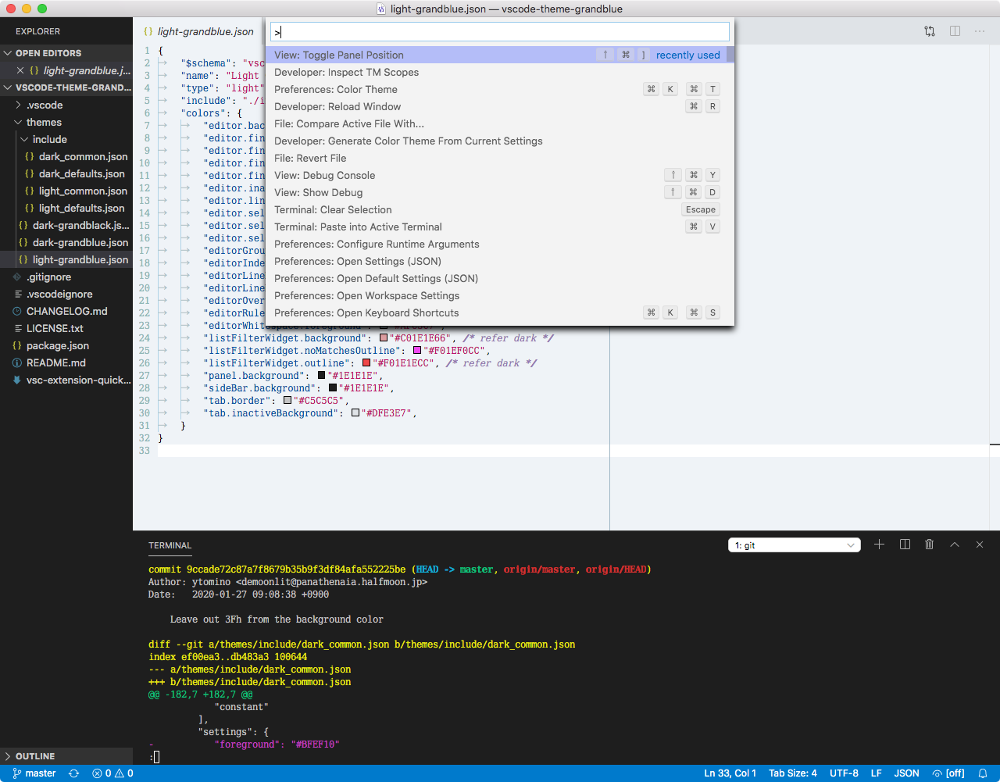
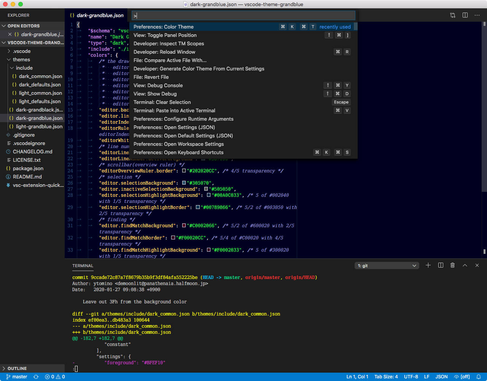
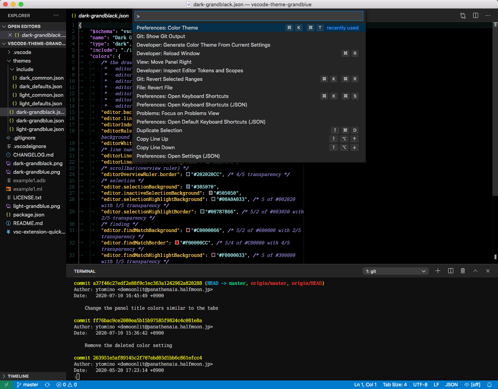

# Visual Studio Code "Grandblue" themes

## Screenshots

### Light Grandblue

### Dark Grandblue

### Dark Grandblack

## Installation

Place the cloned worktree of this repository into `~/.vscode/extensions`.
